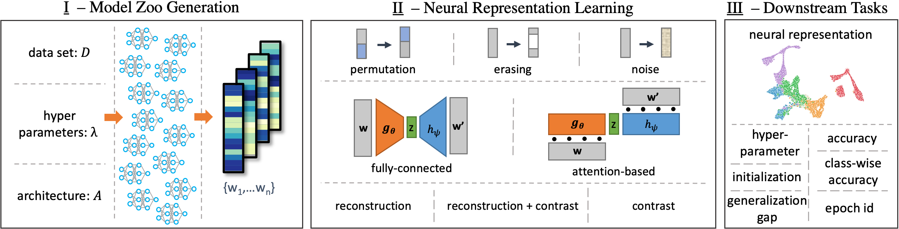

# Introduction
This is the repository to the NeurIPS 2021 paper "Self-Supervised Representation Learning on Neural Network Weights for Model Characteristic Prediction" (https://arxiv.org/abs/arXiv:2110.15288). 
The figure below shows a schematic of the approach. In this repository, we provide code to replicate the ablation studies and downstream tasks. 



Figure: An overview of the proposed self-supervised representation learning approach. I. Populations of trained NNs form model zoos; each model is transformed in a vectorized form of its
weights. II. Neural representations are learned from the model zoos using different augmentations,
architectures, and Self-Supervised Learning tasks. III. Neural representations are evaluated on
downstream tasks which predict model characteristics.


# Datasets
Datasets are available for download under https://zenodo.org/record/5645138. The code in this repository expects the datasets in `./datasets/` The shell script `download_datasets.sh` in `./datasets/` downloads all datasets.
Dataset DOI: 10.5281/zenodo.5645138

To simplify usage, the datasets are precomputed binary files, not the raw data. Datasets are pytorch files containing a dictionary with training, validation and test sets. Train, validation and test sets are custom dataset classes which inherit from the standard torch dataset class.
Dataset class defintions can be found in `/modules/checkpoints_to_datasets/`

Datasets 41, 42, 43 and 44 are our dataset format wrapped around the zoos from Unterthiner et al, 2020 (https://github.com/google-research/google-research/tree/master/dnn_predict_accuracy)


# Dependencies and Packages
Several packages are necessary to run the code in this repository. Code was developed and tested with the following versions:
> python: 3.8.8  
> torch: 1.9.0  
> cuda: 11.3 (not necessary)
> ray: 1.4.0  
> json: 0.9.5  
> numpy: 1.20.1  
> pandas: 1.1.4  
> tqdm: 4.53.0  
> einops: 0.3.0  
> umap-learn: 0.5.1  


# Modules
The code for data preparation, representation learning and downstream task lies in `modules`. 
`checkpoints_to_datasets` contains the data preparation and dataset classes. As the datasets are pre-computed, code there is only for reference and to prevent file loading errors.
`model_definition` contains the code for the models in our model zoos, the representation learning code, as well as the downstream task learners.
> `model_defition/def_net.py`: definition of MLP and CNN models for model zoos.   
> `model_defition/def_simlcr_ae_module.py`: definition of self-supervised representation learning models.   
> `model_defition/def_simlcr_ae_trainable.py`: ray.tune trainable wrapper around the representation learning models.   
> `model_defition/components`: components of the representation learning models, notably `def_loss.py` which defines the losses.   
> `model_defition/downstream_tasks`: contains a generic downstream task learner, as well as implementations of the two baseline models.   

In order to use the local modules in ray.tune actors, navigate to `modules` and install the packages locall with `pip3 install -e .`


# Run experiments
Code for each experiment can be found in its own directory, e.g., `./21_mnist_seed/`. Run `python3 compute_baselines.py` to compute the baselines, and `python3 simclr_ae_xyz.py` to train a neural representation and compute downstream tasks.   
Results of both baselines and downstream tasks are dropped in a subdirectory, e.g., `./21_mnist_seed/mnist_seed/` under `baseline_performance.json` and `results.json`.

# Citation
If you want to cite our work, please use
```
@inproceedings{schurholt_self-supervised_2021,
	address = {Sydney, Australia},
	title = {Self-Supervised Representation Learning on Neural Network Weights for Model Characteristic Prediction},
	author = {Schürholt, Konstantin and Kostadinov, Dimche and Borth, Damian},
	booktitle = {Advances in Neural Information Processing Systems (NeurIPS 2021)},
	year = {2021},
}
```
